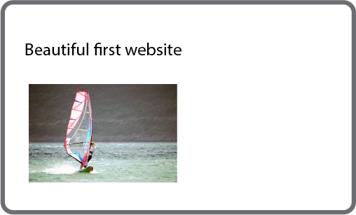
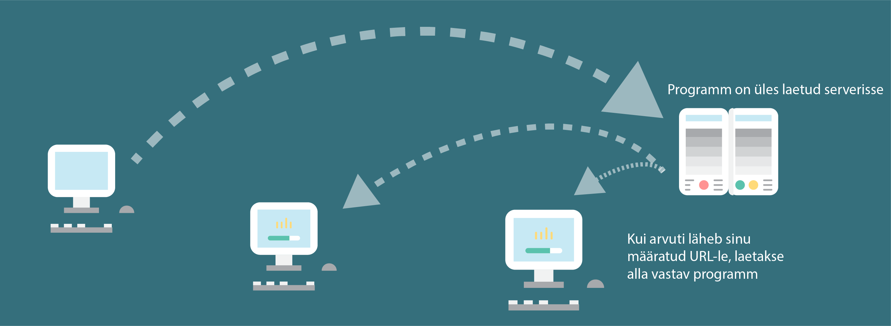

# Javascript veebiarenduse kursus

Projektide tegemine Gatsby raamistikuga

(Kasuta nooli kõrvale, et vahetada slaide)

Adel Müürsepp

Tallinn 2020

---

# Miks veebiarendus on oluline
- Internet on kättesaadav igale inimesele -> võimalus mõjutada inimesi ja maailma su ümber
- Internet teeb innoveerimise lihtsaks -> idee ellu viimine on väga lihtne rakenduse või platvormi abil
- Järjest rohkem on töö tegemisel olulised arvutioskused

---
## Kiirülevaade, kuidas internet toimib
Oletame, et on valmis esimene veebileht, tehtud HTML ja CSS abil

---
Kirjutatud programm on üles laetud serverisse. Sa määrad URL-i, millele minnes laetakse vastav programm internetis olevasse arvutisse

---
Me tegeleme peamiselt Frontendiga

---
BACKEND = Javascript

FRONTEND = HTML + CSS

<iframe height="265" style="width: 100%;" scrolling="no" title="HTML-CSS basic" src="https://codepen.io/adelmuursepp/embed/PoZaWjV?height=265&theme-id=dark&default-tab=html,result" frameborder="no" allowtransparency="true" allowfullscreen="true">
  See the Pen <a href='https://codepen.io/adelmuursepp/pen/PoZaWjV'>HTML-CSS basic</a> by Adel Müürsepp
  (<a href='https://codepen.io/adelmuursepp'>@adelmuursepp</a>) on <a href='https://codepen.io'>CodePen</a>.
</iframe>